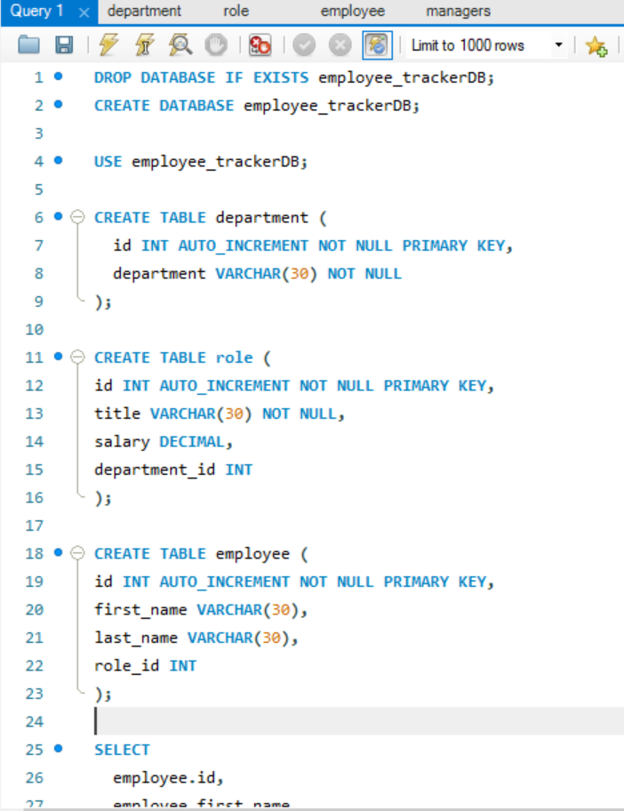

# EmployeeTrackerCLI

## Description

This is a CLI app that demonstrates how a user can keep track of their employees using a database. It uses Inquirer, MySQL, Node.js, and Javascript.

## Table of Contents

 * [Installation](#installation)

 * [Usage](#usage)

 * [Screenshot](#screenshot)

 * [Authors](#authors)

 * [Questions](#questions)

## Installation

- Clone this repo 

- Copy the schema.sql file into MySQL workbench and run it

- Copy the seed.sql file into MySQL workbench and run it next

- Install the dependancies with the terminal command: ``` npm i ```

- Run the application with the command: ``` npm start ```

## Usage

This is a demonstration of how a user can use databases from CLI to access, create, or delete information on a database. 

## Screenshot




## Authors


## Questions

If you have any questions about the repo, open an issue or contact me directly at heyitsbo91@gmail.com. You can find more of my work at [KeithBillings](https://github.com/KeithBillings/)
